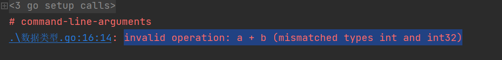

# 数据类型
## 1. Boolean
在Go中，布尔值的类型为bool，值是true或false，默认为false。
```go
var isActive bool  // 全局变量声明
var enabled, disabled = true, false  // 忽略类型的声明
func test() {
	var available bool  // 一般声明
	valid := false      // 简短声明
	available = true    // 赋值操作
}
```

## 2. 数值类型
数值类型分为有符号及无符号两种，Go同时支持int和uint。

Go里面有一些直接定义好位数的类型：rune, int8, int16, int32, int64和byte, uint8, uint16, uint32, uint64。其中rune是int32的别称，byte是uint8的别称

不同变量类型之间不能进行赋值及操作，否则会在编译时报错。


## 3. 字符串
跟Python一样，go中的字符串是不可变的

## 4. 错误类型
go 提供了内置包定义新的错误类型
```go
err := errors.New("emit macho dwarf: elf header corrupted")
if err != nil {
	fmt.Print(err)
}
```
## array、slice、map
array 数组，数组的大小是不可变的。可以通过以下方式定义
n代表数组的大小，type代表数组元素的数据类型。

与python语言一致，可以通过元素下标来进行读取或赋值
```go
var arr [n]type
var arr [5]int
arr := [5]string{"1", "2", "3", "4","5"}
arr[2] = "88"
```
多维数组也是OK的。操作也跟python类似
```go
arr2 := [2][2]int{{1,2}, {2,3}}
arr2[0][0] = 100
```
slice
array大小是不可变的，很多时候不适用我们的场景，更多时候我们需要一个可变的数组
go里边称为切片，slice

slice的声明与array类似，只是不需要指定长度，在底层数据结构上，slice由三部分组成

1. 指针，指向一个array
2. 长度
3. 容量大小，根据情况进行扩大缩小
```go
sli1 := []int{1,2,3}
```
# 零值
变量声明但是未赋值时，go会根据类型，默认给这些变量一个初始值，也就是零值
```bash
int     0
int8    0
int32   0
int64   0
uint    0x0
rune    0 //rune的实际类型是 int32
byte    0x0 // byte的实际类型是 uint8
float32 0 //长度为 4 byte
float64 0 //长度为 8 byte
bool    false
string  ""
```

